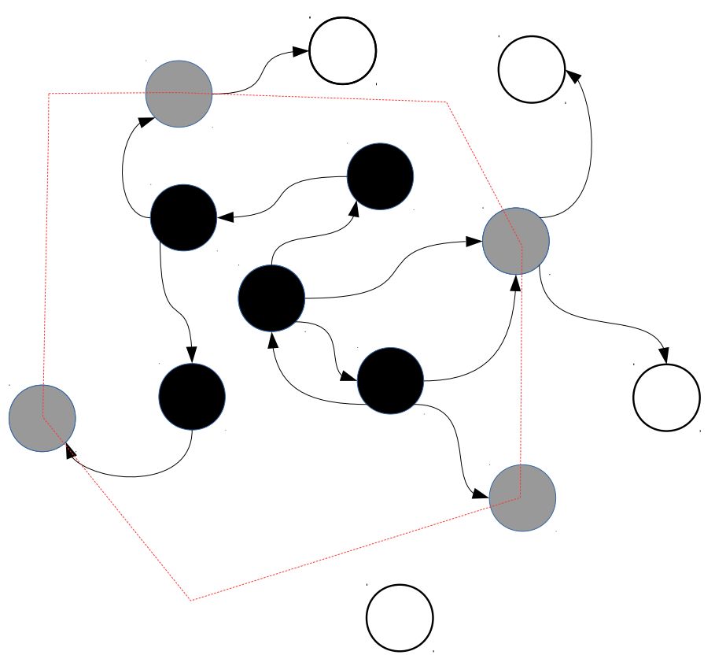
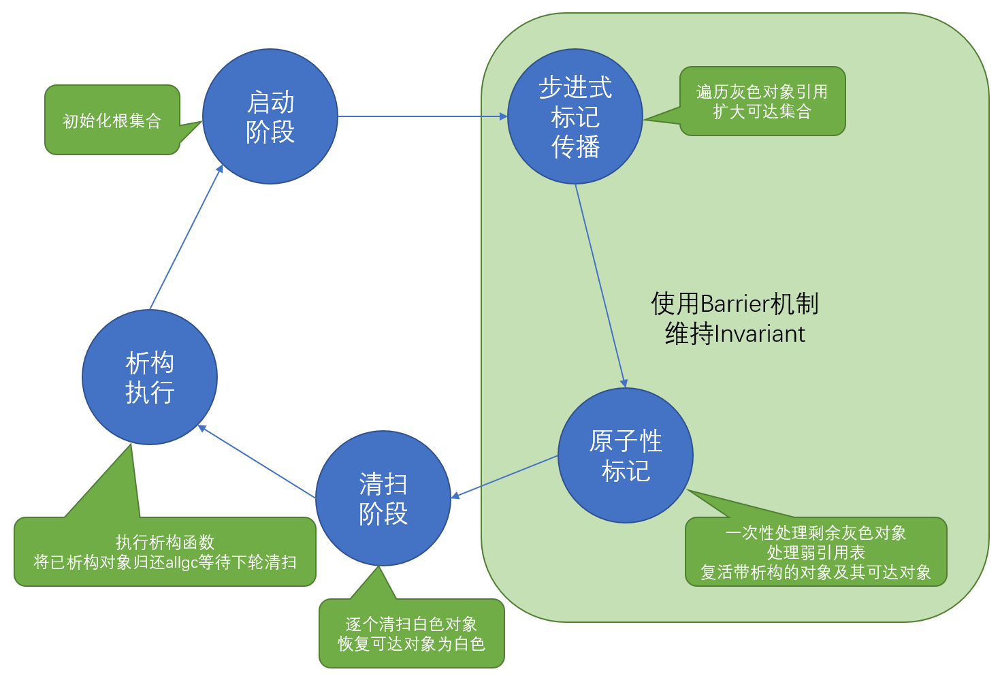

[toc]

## 基本机制

Lua从5.1开始垃圾回收采用步进式的标记清扫算法，这种算法不会造成Stop the World问题，但是想要在垃圾回收和正常指令交替执行的情况下正确地进行标记，需要更多复杂的机制保证算法正确性。

Lua采用三色标记算法，每个对象有三种状态：白色、灰色、黑色。白色的对象是无法访问到的或是当前还未访问到的；灰色对象是已经访问到的，但是它引用的其他对象还没完全扫描完；黑色的对象是已经访问并且完全扫描的。

标记扫描算法的基本思想就是，从一个根集合开始，递归遍历其中每个对象及其引用的对象为他们染色。染色完毕后，白色的节点就是无法访问到的节点，可以在清扫阶段回收掉。那么现在问题就是如何保证步进式的标记算法的正确性。

在标记阶段，下列约束（`invariant`）必须保持满足：
 - 根集引用的对象要么是黑色要么是灰色
 - 黑色对象不能直接引用白色对象
 
符合上述约束的图，看上去就是灰色节点是黑色与白色节点的边界，随着标记算法的推进，灰色边界不断扩大，黑色节点逐渐变多。



但是我们的标记算法和程序指令交替进行会破坏上述约束，比如我们有一个黑色的表t和一个白色的对象a，执行t.x=a时，会让黑色对象引用白色对象。这种情况下我们需要插入一个barrier来处理，使得约束能够满足。

Lua中有两种方式维持约束，一种是立即标记白色对象，将其变成灰色或黑色，另一种是把黑色对象变灰。lgc.c中分别定义了这两个方法：`luaC_barrier_`和`luaC_barrierback_`。至于何时采用何种方法，需要视情况决定，不同方法各有优势，这在后文中再讨论。

在清扫阶段，GC和程序指令交替执行可能会导致这段时间内新创建的对象是白色的，但是这种白色对象不应该被清扫，所以Lua设计了两种不同的白色，采用乒乓开关的形式轮流使用，比如本轮GC白色1表示无法访问，白色2表示新建对象，那下一轮GC白色2就是无法访问，白色1就是新建对象。

以上就是Lua的垃圾回收基本机制，下面结合源码看看具体实现。

## 实现源码

### 结构定义

`lobject.h`
```
#define CommonHeader    GCObject *next; lu_byte tt; lu_byte marked

struct GCObject {
  CommonHeader;
};
```

首先是所有可以被GC的对象都有一个公共头部，next指针用于维护所有可GC对象的一个链表，tt记录了对象类型用于决定标记时的递归遍历方法，marked是GC标记，按位记录了对象的颜色、是否有析构方法、是否永不回收。

`lobject.h`
```
typedef struct Table {
  CommonHeader;
  /* fold */
  GCObject *gclist;
} Table;
```

对于部分可以变成灰色的对象，其结构内部还有一个gclist指针，用于维护其所在的灰色对象链表。

`lstate.h`
```
typedef struct global_State {
  lu_byte currentwhite;
  lu_byte gcstate;  /* state of garbage collector */
  /* fold */
  GCObject *allgc;  /* list of all collectable objects */
  GCObject **sweepgc;  /* current position of sweep in list */
  GCObject *finobj;  /* list of collectable objects with finalizers */
  GCObject *gray;  /* list of gray objects */
  GCObject *grayagain;  /* list of objects to be traversed atomically */
  GCObject *weak;  /* list of tables with weak values */
  GCObject *ephemeron;  /* list of ephemeron tables (weak keys) */
  GCObject *allweak;  /* list of all-weak tables */
  GCObject *tobefnz;  /* list of userdata to be GC */
  GCObject *fixedgc;  /* list of objects not to be collected */
} global_State;
```

上面展示了全局环境中维护的所有GC对象链表，可以将其分为两类，一类是通过next指针维护的全部对象，另一类是通过gclist指针维护的灰色对象。不同类型的链表可能有重复对象，同一类型的链表元素都是不重复的。

第一类链表有如下几个：
 - allgc：普通的GC对象
 - finobj：带有析构函数的GC对象
 - tobefnz：带有析构函数且已经无法访问到的GC对象
 - fixedgc：永不GC的对象
 
第二类链表有如下几个：
 - gray：灰色的GC对象
 - grayagain：从黑色变灰的GC对象，此列表不再反复步进遍历，而是最终一次性遍历完成
 - weak：值弱引用表
 - ephemeron：键弱引用表
 - allweak：完全弱引用表
 
sweepgc指针用于保存当前清扫阶段应该清扫哪个GC链表。

### GC流程

GC的整个过程就是从根集开始遍历，将各个对象标记为黑色，或是变成灰色在第二类链表中流转并最终变黑，最终清除白色节点的过程。第一类链表主要是用在清除阶段分类型清除，因为带有析构函数的对象在清除前需要调用析构函数，为了防止析构函数执行时这些对象引用的对象已经被回收导致执行出错，我们要把需要析构的对象单独拿出来放到tobefnz链表中，然后以他们为根集再遍历标记一遍，就可以防止他们引用的对象被提前回收了。而这些具有析构函数的对象以及他们引用的对象，因为在本轮GC中被标记了，所以只能等到下一轮GC才能回收。

下面整理一下GC的整个流程状态转换模型。因为这里采用的是步进式的算法，我们需要知道每次恢复GC执行的时候，上次执行的状态是怎么样的，因此Lua引入了一个状态机来记录当前所在的状态。这个状态机比较简单，就是按照数字顺序从小到大循环流转，下面注释里简单解释了各个状态的任务。

`lgc.h`
```
#define GCSpropagate    0  // 传播阶段，步进式标记对象，需要保持invariant
#define GCSatomic  1  // 原子性标记阶段，一次性标记完剩余的不能步进式标记的对象，需要保持invariant
#define GCSswpallgc    2 // 步进式清扫allgc链表中的白色对象
#define GCSswpfinobj   3  // 步进式清扫finobj链表中的白色对象
#define GCSswptobefnz  4  // 步进式清扫tobefnz链表中的白色对象
#define GCSswpend  5  // 清扫结束
#define GCScallfin 6  // 步进式运行析构函数阶段
#define GCSpause   7  // GC暂停
```

#### 启动阶段：GCSpause -> GCSpropagate

```
case GCSpause: {
  g->GCmemtrav = g->strt.size * sizeof(GCObject*);
  restartcollection(g);
  g->gcstate = GCSpropagate;
  return g->GCmemtrav;
}
```
```
static void restartcollection (global_State *g) {
  g->gray = g->grayagain = NULL;
  g->weak = g->allweak = g->ephemeron = NULL;
  markobject(g, g->mainthread);
  markvalue(g, &g->l_registry);
  markmt(g);
  markbeingfnz(g);  /* mark any finalizing object left from previous cycle */
}
```
GC启动阶段，先将第二类链表全部置空，然后初始化根集，分别是Lua主线程、注册表、基础类型的元方法、上轮没析构完的对象。

#### 步进式标记传播阶段：GCSpropagate
```
case GCSpropagate: {
  g->GCmemtrav = 0;
  lua_assert(g->gray);
  propagatemark(g);
   if (g->gray == NULL)  /* no more gray objects? */
    g->gcstate = GCSatomic;  /* finish propagate phase */
  return g->GCmemtrav;  /* memory traversed in this step */
}
```
```
static void propagatemark (global_State *g) {
  lu_mem size;
  GCObject *o = g->gray;
  lua_assert(isgray(o));
  gray2black(o);
  switch (o->tt) {
    case LUA_TTABLE: {
      Table *h = gco2t(o);
      g->gray = h->gclist;  /* remove from 'gray' list */
      size = traversetable(g, h);
      break;
    }
    case LUA_TLCL: {
      LClosure *cl = gco2lcl(o);
      g->gray = cl->gclist;  /* remove from 'gray' list */
      size = traverseLclosure(g, cl);
      break;
    }
    case LUA_TCCL: {
      CClosure *cl = gco2ccl(o);
      g->gray = cl->gclist;  /* remove from 'gray' list */
      size = traverseCclosure(g, cl);
      break;
    }
    case LUA_TTHREAD: {
      lua_State *th = gco2th(o);
      g->gray = th->gclist;  /* remove from 'gray' list */
      linkgclist(th, g->grayagain);  /* insert into 'grayagain' list */
      black2gray(o);
      size = traversethread(g, th);
      break;
    }
    case LUA_TPROTO: {
      Proto *p = gco2p(o);
      g->gray = p->gclist;  /* remove from 'gray' list */
      size = traverseproto(g, p);
      break;
    }
    default: lua_assert(0); return;
  }
  g->GCmemtrav += size;
}
```

步进式标记阶段，从gray列表中取出一个灰色对象，遍历它引用的其他对象，这样这个对象就可以从灰色变成黑色，并且扩大了已标记集合。需要注意的是，gray列表仅保存了部分灰色对象，这些灰色对象是可以在步进式标记阶段逐个遍历的，而第二类链表中的其他链表也保存了各种不同的灰色对象，这些对象需要在原子性标记阶段一次性标记完成。比如看到LUA_TTHREAD的处理，就要求线程对象永远保持灰色，并加入grayagain列表，这样以后步进式标记就不用反复标记它了，还有其他一些弱引用表或者触发了barrier机制的对象，都可能不在gray列表里。

遍历过程中的标记最终都落实到下面这个`reallymarkobject`函数，例如我们从gray列表中取出了一个表（强引用表），想要把这个表变成黑色，必须将它数组部分持有的白色的值、hash部分持有的白色的键和白色的值都通过这个函数标记一遍。

`reallymarkobject`函数针对不同类型的对象采用不同标记手段，首先我们可以确定这个对象至少应该变成灰色，然后根据对象类型判断它有没有可能引用别的对象，比如字符串就没有引用别的对象，那么这里直接变黑即可，userdata引用的对象数量有限（只有元表和其持有的值）也可以现场标记它们然后把userdata变黑，而其他类型可能引用许多对象，就把他们加入gray列表等待下次步进再分析。

```
static void reallymarkobject (global_State *g, GCObject *o) {
 reentry:
  white2gray(o);
  switch (o->tt) {
    case LUA_TSHRSTR: {
      gray2black(o);
      g->GCmemtrav += sizelstring(gco2ts(o)->shrlen);
      break;
    }
    case LUA_TLNGSTR: {
      gray2black(o);
      g->GCmemtrav += sizelstring(gco2ts(o)->u.lnglen);
      break;
    }
    case LUA_TUSERDATA: {
      TValue uvalue;
      markobjectN(g, gco2u(o)->metatable);  /* mark its metatable */
      gray2black(o);
      g->GCmemtrav += sizeudata(gco2u(o));
      getuservalue(g->mainthread, gco2u(o), &uvalue);
      if (valiswhite(&uvalue)) {  /* markvalue(g, &uvalue); */
        o = gcvalue(&uvalue);
        goto reentry;
      }
      break;
    }
    case LUA_TLCL: {
      linkgclist(gco2lcl(o), g->gray);
      break;
    }
    case LUA_TCCL: {
      linkgclist(gco2ccl(o), g->gray);
      break;
    }
    case LUA_TTABLE: {
      linkgclist(gco2t(o), g->gray);
      break;
    }
    case LUA_TTHREAD: {
      linkgclist(gco2th(o), g->gray);
      break;
    }
    case LUA_TPROTO: {
      linkgclist(gco2p(o), g->gray);
      break;
    }
    default: lua_assert(0); break;
  }
}
```

其他有可能导致对象在第二类链表中流转的方法是，触发了barrier机制。在需要维持invariant的阶段，如果给一个黑色对象添加一个白色的引用，要么触发`luaC_barrier_`立即当场标记白色对象，要么触发`luaC_barrierback_`将黑色对象变灰，同时加入grayagain列表，这里加入grayagain列表而不加入gray列表的考虑可能是，如果在GC执行中给对象添加了引用，那么很可能这段时间会持续添加引用（局部性原理），为了不反复地改变它的颜色浪费性能，就将其加入grayagain列表等到原子性标记阶段一次性解决即可。

```
void luaC_barrier_ (lua_State *L, GCObject *o, GCObject *v) {
  global_State *g = G(L);
  lua_assert(isblack(o) && iswhite(v) && !isdead(g, v) && !isdead(g, o));
  if (keepinvariant(g))  /* must keep invariant? */
    reallymarkobject(g, v);  /* restore invariant */
  else {  /* sweep phase */
    lua_assert(issweepphase(g));
    makewhite(g, o);  /* mark main obj. as white to avoid other barriers */
  }
}

void luaC_barrierback_ (lua_State *L, Table *t) {
  global_State *g = G(L);
  lua_assert(isblack(t) && !isdead(g, t));
  black2gray(t);  /* make table gray (again) */
  linkgclist(t, g->grayagain);
}
```

#### 原子性标记阶段：GCSatomic

```
case GCSatomic: {
  lu_mem work;
  propagateall(g);  /* make sure gray list is empty */
  work = atomic(L);  /* work is what was traversed by 'atomic' */
  entersweep(L);
  g->GCestimate = gettotalbytes(g);  /* first estimate */;
  return work;
}
```
```
static void propagateall (global_State *g) {
  while (g->gray) propagatemark(g);
}

static void entersweep (lua_State *L) {
  global_State *g = G(L);
  g->gcstate = GCSswpallgc;
  lua_assert(g->sweepgc == NULL);
  g->sweepgc = sweeplist(L, &g->allgc, 1);
}
```

原子性标记阶段，需要一次性标记完不能步进式标记的所有对象，然后进入清扫阶段。首先它把gray列表里的对象先全部标记传播一遍，本来是gray列表全空了才能进入原子性标记阶段，但是可能在步进式切换到原子性阶段期间，执行了程序指令，造成barrier触发导致新增了一些灰色对象，所以需要先标记一遍gray列表。

原子性标记阶段的主要功能在`atomic`函数中实现，它主要有两方面任务：一是标记处理第二类链表中的对象，主要是在步进式标记阶段保持灰色的对象（grayagain）以及弱引用表（weak、ephemeron、allweak）；二是处理第一类链表中带有析构函数的对象。下面我们拆解这两部分功能来看看他们的具体用途。

```
static l_mem atomic (lua_State *L) {
  global_State *g = G(L);
  l_mem work;
  GCObject *origweak, *origall;
  GCObject *grayagain = g->grayagain;  /* save original list */
  lua_assert(g->ephemeron == NULL &&g->weak == NULL);
  lua_assert(!iswhite(g->mainthread));
  g->gcstate = GCSinsideatomic;
  g->GCmemtrav = 0;  /* start counting work */
  markobject(g, L);  /* mark running thread */
  /* registry and global metatables may be changed by API */
  markvalue(g, &g->l_registry);
  markmt(g);  /* mark global metatables */
  /* remark occasional upvalues of (maybe) dead threads */
  remarkupvals(g);
  propagateall(g);  /* propagate changes */
  work = g->GCmemtrav;  /* stop counting (do not recount 'grayagain') */
  g->gray = grayagain;
  propagateall(g);  /* traverse 'grayagain' list */
  g->GCmemtrav = 0;  /* restart counting */
  convergeephemerons(g);
  /* at this point, all strongly accessible objects are marked. */
  /* Clear values from weak tables, before checking finalizers */
  clearvalues(g, g->weak, NULL);
  clearvalues(g, g->allweak, NULL);
  origweak = g->weak; origall = g->allweak;
  work += g->GCmemtrav;  /* stop counting (objects being finalized) */
  separatetobefnz(g, 0);  /* separate objects to be finalized */
  g->gcfinnum = 1;  /* there may be objects to be finalized */
  markbeingfnz(g);  /* mark objects that will be finalized */
  propagateall(g);  /* remark, to propagate 'resurrection' */
  g->GCmemtrav = 0;  /* restart counting */
  convergeephemerons(g);
  /* at this point, all resurrected objects are marked. */
  /* remove dead objects from weak tables */
  clearkeys(g, g->ephemeron, NULL);  /* clear keys from all ephemeron tables */
  clearkeys(g, g->allweak, NULL);  /* clear keys from all 'allweak' tables */
  /* clear values from resurrected weak tables */
  clearvalues(g, g->weak, origweak);
  clearvalues(g, g->allweak, origall);
  luaS_clearcache(g);
  g->currentwhite = cast_byte(otherwhite(g));  /* flip current white */
  work += g->GCmemtrav;  /* complete counting */
  return work;  /* estimate of memory marked by 'atomic' */
}
```

`处理第二类链表相关代码片段`
```
static l_mem atomic (lua_State *L) {
/* 首先把所有可能变化过的对象重新标记一下 */
  GCObject *grayagain = g->grayagain;  /* save original list */
  markobject(g, L);  /* mark running thread */
  /* registry and global metatables may be changed by API */
  markvalue(g, &g->l_registry);
  markmt(g);  /* mark global metatables */
  /* remark occasional upvalues of (maybe) dead threads */
  remarkupvals(g);
  propagateall(g);  /* propagate changes */
  
 /* 然后把保持灰色的对象标记完 */
  g->gray = grayagain;
  propagateall(g);  /* traverse 'grayagain' list */
  
/* 到这里我们已经尽可能地标记了所有可达对象为黑色 */
/* 开始处理键弱引用表 */
  convergeephemerons(g);
  /* at this point, all strongly accessible objects are marked. */
  /* Clear values from weak tables, before checking finalizers */
  clearvalues(g, g->weak, NULL);
  clearvalues(g, g->allweak, NULL);
  origweak = g->weak; origall = g->allweak;

/* 此处是复活带有析构的对象相关代码 */

/* 剩余 white -> white 键弱引用表的键可能被复活改变了颜色，继续处理 */
  convergeephemerons(g);
  /* at this point, all resurrected objects are marked. */
  /* remove dead objects from weak tables */
  clearkeys(g, g->ephemeron, NULL);  /* clear keys from all ephemeron tables */
  clearkeys(g, g->allweak, NULL);  /* clear keys from all 'allweak' tables */
  /* clear values from resurrected weak tables */
  clearvalues(g, g->weak, origweak);
  clearvalues(g, g->allweak, origall);
}
```

上述代码片段是处理第二类链表相关的代码，首先它需要标记传播gray、grayagain里的对象，在遇到弱引用表时，按照键值的弱引用情况，分别放到weak（值弱引用）、ephemeron（键弱引用）、allweak（键值弱引用）链表中。进行适当的标记传播后，可以清除表中的弱引用对象（`clearkeys`、`clearvalues`）。

对于allweak表，我们不需要传播任何标记，因为他们的键值都是弱引用的。而对于值弱引用表，我们在之前的标记传播阶段就已经标记了所有的key为黑色，值的颜色不会因为这张表而改变了。但对于键弱引用表，我们不能提前处理值的颜色，我们要根据键的颜色来确定值的颜色，如果键是黑色的，那么它对应的值也应该是黑色，否则值的颜色不用改变。但一旦我们在处理过程中做了标记传播，那可能造成更多的键变成黑色，因此这个过程是循环的，直到我们处理过程中没发生任何标记传播为止。

下面的代码就是处理键弱引用表相关代码，可以看到`convergeephemerons`先保存了ephemeron指针，因为这个列表可能在后续遍历过程中被插入新元素来等待下次遍历。然后对所有的键弱引用表，调用`traverseephemeron`，这个函数的功能就是把黑色的键对应的值设置为黑色（或灰色），它的返回值表示过程中有没有改变某个对象的颜色，用于外层判断需不需要标记传播。同时看到第49-50行，它在这个表中还存在white -> white键值时重新加入ephemeron链表，因为存在这种值就有可能发生key变黑需要重新标记对应的value。

一切处理完毕后，gray、grayagain链表里没有对象，weak、allweak、ephemeron中应该保持引用的对象已经变黑，白色的对象已经被踢出表。

`键弱引用表相关处理代码`
```
static void convergeephemerons (global_State *g) {
  int changed;
  do {
    GCObject *w;
    GCObject *next = g->ephemeron;  /* get ephemeron list */
    g->ephemeron = NULL;  /* tables may return to this list when traversed */
    changed = 0;
    while ((w = next) != NULL) {
      next = gco2t(w)->gclist;
      if (traverseephemeron(g, gco2t(w))) {  /* traverse marked some value? */
        propagateall(g);  /* propagate changes */
        changed = 1;  /* will have to revisit all ephemeron tables */
      }
    }
  } while (changed);
}

static int traverseephemeron (global_State *g, Table *h) {
  int marked = 0;  /* true if an object is marked in this traversal */
  int hasclears = 0;  /* true if table has white keys */
  int hasww = 0;  /* true if table has entry "white-key -> white-value" */
  Node *n, *limit = gnodelast(h);
  unsigned int i;
  /* traverse array part */
  for (i = 0; i < h->sizearray; i++) {
    if (valiswhite(&h->array[i])) {
      marked = 1;
      reallymarkobject(g, gcvalue(&h->array[i]));
    }
  }
  /* traverse hash part */
  for (n = gnode(h, 0); n < limit; n++) {
    checkdeadkey(n);
    if (ttisnil(gval(n)))  /* entry is empty? */
      removeentry(n);  /* remove it */
    else if (iscleared(g, gkey(n))) {  /* key is not marked (yet)? */
      hasclears = 1;  /* table must be cleared */
      if (valiswhite(gval(n)))  /* value not marked yet? */
        hasww = 1;  /* white-white entry */
    }
    else if (valiswhite(gval(n))) {  /* value not marked yet? */
      marked = 1;
      reallymarkobject(g, gcvalue(gval(n)));  /* mark it now */
    }
  }
  /* link table into proper list */
  if (g->gcstate == GCSpropagate)
    linkgclist(h, g->grayagain);  /* must retraverse it in atomic phase */
  else if (hasww)  /* table has white->white entries? */
    linkgclist(h, g->ephemeron);  /* have to propagate again */
  else if (hasclears)  /* table has white keys? */
    linkgclist(h, g->allweak);  /* may have to clean white keys */
  return marked;
}
```

下面的代码是处理第一类链表中带有析构函数的对象的相关代码。因为在回收前要执行析构函数，所以我们不能把这些对象可达的对象提前回收了，需要把他们标记成黑色暂时复活，等本轮析构执行完了，下一轮GC再回收。因此两个函数的主要用途就是：`separatetobefnz`把finobj链表中的白色对象移动到tobefnz链表中，其中finobj链表记录了所有具有析构函数的对象；`markbeingfnz`标记tobefnz链表中的所有对象。完成后再进行完整的标记传播`propagateall`，即可复活所有被析构的对象可达的对象。

`处理第一类链表相关代码`
```
static l_mem atomic (lua_State *L) {
  separatetobefnz(g, 0);  /* separate objects to be finalized */
  markbeingfnz(g);  /* mark objects that will be finalized */
  propagateall(g);  /* remark, to propagate 'resurrection' */
}

static void separatetobefnz (global_State *g, int all) {
  GCObject *curr;
  GCObject **p = &g->finobj;
  GCObject **lastnext = findlast(&g->tobefnz);
  while ((curr = *p) != NULL) {  /* traverse all finalizable objects */
    lua_assert(tofinalize(curr));
    if (!(iswhite(curr) || all))  /* not being collected? */
      p = &curr->next;  /* don't bother with it */
    else {
      *p = curr->next;  /* remove 'curr' from 'finobj' list */
      curr->next = *lastnext;  /* link at the end of 'tobefnz' list */
      *lastnext = curr;
      lastnext = &curr->next;
    }
  }
}

static void markbeingfnz (global_State *g) {
  GCObject *o;
  for (o = g->tobefnz; o != NULL; o = o->next)
    markobject(g, o);
}
```

另外，对象加入finobj链表是在设置元表的时候检查的，每当设置元表，都需要调用下面这个`luaC_checkfinalizer`函数，它的作用就是检查元表里是否设置了析构函数，有的话就把这个对象从allgc链表中踢出来（通过遍历找到他的父节点），然后加入finobj链表。

需要注意的是，这个函数代价比较大，需要遍历allgc链表，等于遍历Lua环境中所有对象，所以只在设置元表的时候进行，如果已经设置了元表，再向元表里添加析构函数，是不会让析构函数生效的。

`检查元表中是否有析构函数并移动到finobj链表`
```
void luaC_checkfinalizer (lua_State *L, GCObject *o, Table *mt) {
  global_State *g = G(L);
  if (tofinalize(o) ||                 /* obj. is already marked... */
      gfasttm(g, mt, TM_GC) == NULL)   /* or has no finalizer? */
    return;  /* nothing to be done */
  else {  /* move 'o' to 'finobj' list */
    GCObject **p;
    if (issweepphase(g)) {
      makewhite(g, o);  /* "sweep" object 'o' */
      if (g->sweepgc == &o->next)  /* should not remove 'sweepgc' object */
        g->sweepgc = sweeptolive(L, g->sweepgc);  /* change 'sweepgc' */
    }
    /* search for pointer pointing to 'o' */
    for (p = &g->allgc; *p != o; p = &(*p)->next) { /* empty */ }
    *p = o->next;  /* remove 'o' from 'allgc' list */
    o->next = g->finobj;  /* link it in 'finobj' list */
    g->finobj = o;
    l_setbit(o->marked, FINALIZEDBIT);  /* mark it as such */
  }
}
```

至此，原子性标记阶段的主要工作就介绍完毕了，此时所有的对象非黑即白，可以开始清扫白色对象了。

#### 清扫阶段：GCSswpallgc、GCSswpfinobj、GCSswptobefnz、GCSswpend

```
case GCSswpallgc: {  /* sweep "regular" objects */
  return sweepstep(L, g, GCSswpfinobj, &g->finobj);
}
case GCSswpfinobj: {  /* sweep objects with finalizers */
  return sweepstep(L, g, GCSswptobefnz, &g->tobefnz);
}
case GCSswptobefnz: {  /* sweep objects to be finalized */
  return sweepstep(L, g, GCSswpend, NULL);
}
case GCSswpend: {  /* finish sweeps */
  makewhite(g, g->mainthread);  /* sweep main thread */
  checkSizes(L, g);
  g->gcstate = GCScallfin;
  return 0;
}
```

```
static lu_mem sweepstep (lua_State *L, global_State *g,
                         int nextstate, GCObject **nextlist) {
  if (g->sweepgc) {
    l_mem olddebt = g->GCdebt;
    g->sweepgc = sweeplist(L, g->sweepgc, GCSWEEPMAX);
    g->GCestimate += g->GCdebt - olddebt;  /* update estimate */
    if (g->sweepgc)  /* is there still something to sweep? */
      return (GCSWEEPMAX * GCSWEEPCOST);
  }
  /* else enter next state */
  g->gcstate = nextstate;
  g->sweepgc = nextlist;
  return 0;
}

static GCObject **sweeplist (lua_State *L, GCObject **p, lu_mem count) {
  global_State *g = G(L);
  int ow = otherwhite(g);
  int white = luaC_white(g);  /* current white */
  while (*p != NULL && count-- > 0) {
    GCObject *curr = *p;
    int marked = curr->marked;
    if (isdeadm(ow, marked)) {  /* is 'curr' dead? */
      *p = curr->next;  /* remove 'curr' from list */
      freeobj(L, curr);  /* erase 'curr' */
    }
    else {  /* change mark to 'white' */
      curr->marked = cast_byte((marked & maskcolors) | white);
      p = &curr->next;  /* go to next element */
    }
  }
  return (*p == NULL) ? NULL : p;
}
```

进入Lua GC的清扫阶段，清扫阶段也是步进式的，主要工作就是按顺序清扫allgc、finobj、tobefnz链表中的白色对象，遇到白色对象就调用`freeobj`释放内存，遇到黑色对象就将其置为白色。需要注意的是，这里只清扫不是当前白色的白色，因为在标记阶段结束时已经翻转了白色，此后新建的对象或者已经被清扫算法查看过的对象，都会被置为当前白色，所以需要清扫的是另一种白色。

#### 析构执行阶段：GCScallfin

```
case GCScallfin: {  /* call remaining finalizers */
  if (g->tobefnz && g->gckind != KGC_EMERGENCY) {
    int n = runafewfinalizers(L);
    return (n * GCFINALIZECOST);
  }
  else {  /* emergency mode or no more finalizers */
    g->gcstate = GCSpause;  /* finish collection */
    return 0;
  }
}
```

Lua GC的最后一个阶段，就是运行析构函数阶段，记得之前我们专门把带有析构函数的对象及其可达对象复活了，就是为了在这里执行他们的析构函数。执行完析构函数的对象会被还回到allgc链表中，等待下一轮GC将他们回收。

至此，Lua GC的所有阶段已经介绍完毕，每个阶段都可以分步多次执行直到满足条件进入下一个阶段（除了原子性标记阶段一步执行完毕），GC算法就这样周而复始不断地标记、清扫着内存。下图是对整个GC流程的一个总结。


